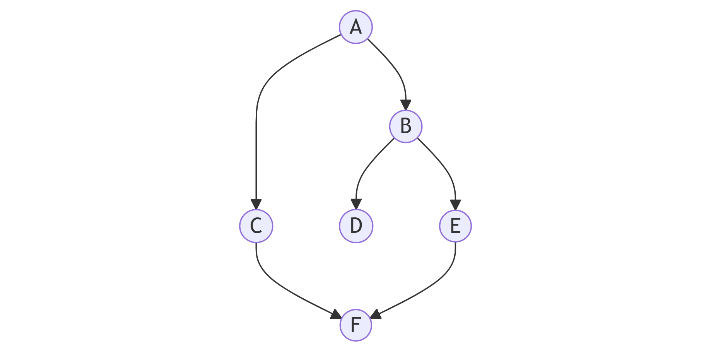

# AI-Algo

This project was created for our Artificial Intelligence class. It demonstrates the application of three core algorithms:

- **Breadth-First Search (BFS)**
- **Depth-First Search (DFS)**
- **Minimax Algorithm**

---

## Prepared by

- Ahmed Ashraf  
- Abdelrhman Allam  
- Dina Samy  
- Esraa Saied  
- Haneen Wael  
- Haneen Hatem  
- Ala Samir  
- Rana Ashraf  
- Roaa Atef  

---

## DFS traversal example (directed graph starting from A)

**Problem type:**  
Find the traversal path in a directed graph starting from node A using Depth-First Search (DFS).

**Graph image:**  

**Step-by-step explanation:**
1. **Step 1:** Start at node A.  
2. **Step 2:** Move from A to node C.  
3. **Step 3:** From C, go to node F.  
4. **Step 4:** F has no outgoing unvisited edges → backtrack to C, then to A.  
5. **Step 5:** From A, visit node B.  
6. **Step 6:** From B, go to node D.  
7. **Step 7:** After D, visit node E.  

**Final traversal order:**  
A → C → F → B → D → E

**Code:**  
Add your DFS implementation to `codes/dfs.py` and link it here.  
[`codes/dfs.py`](codes/DFS Traversal.py)
---